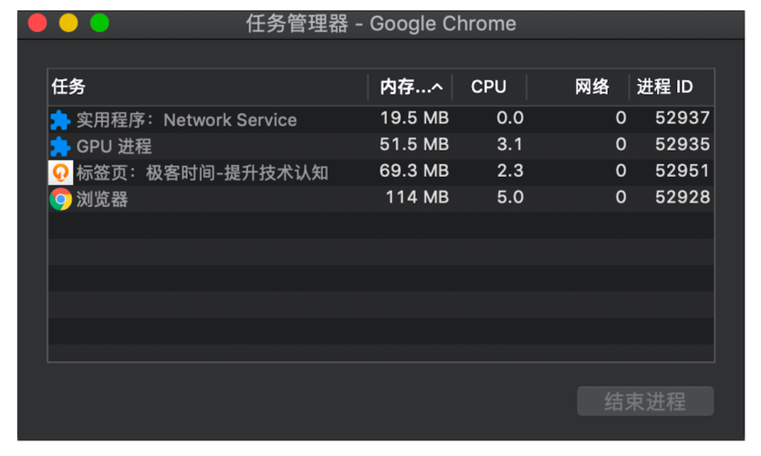
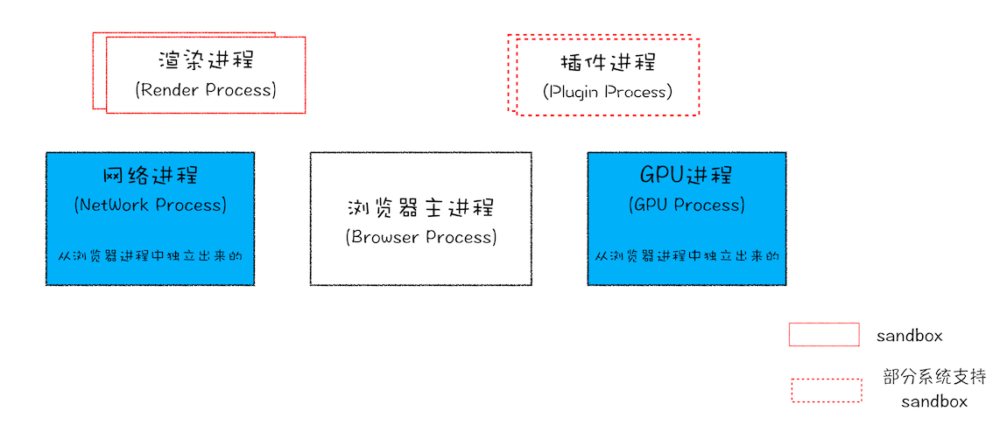
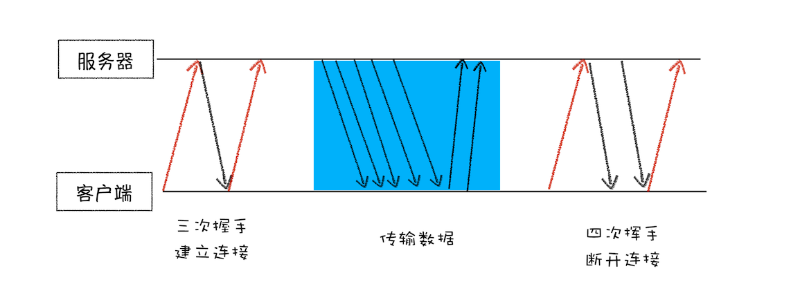

## Chrome架构

### Chrome架构

Chrome任务管理器

### 进程和线程

#### 线程

- 单线程

顺序执行

- 多线程

并行处理

多线程可以并行处理任务，但是线程不能单独存在，是由进程来启动和管理的。

#### 进程

> 一个进程就是一个程序的运行实例。

详细解释就是，启动一个程序的时候，操作系统会为该程序创建一块内存，用来存放代码、运行中的数据和一个执行任务的主线程，我们把这样的一个运行环境叫进程。

进程和线程之间的关系有以下4个特点。

1. 进程中的任意一线程执行出错，都会导致整个进程的崩溃。

2. 线程之间共享进程中的数据。

3. 当一个进程关闭之后，操作系统会回收进程所占用的内存。

4. 进程之间的内容相互隔离。

#### 多进程架构

从图中可以看出，最新的Chrome浏览器包括：1个浏览器（Browser）主进程、1个 GPU 进程、1个网络（NetWork）进程、多个渲染进程和多个插件进程。

## TCP协议

FP：First Paint，页面加载到首次开始绘制的时长。

### 一个数据包的"旅程"

- IP：网际协议

把数据包送达目的主机

- UDP：用户数据包协议

把数据包送达应用程序，通过端口号去区分正确的程序。

- TCP：传输控制协议

> TCP（Transmission Control Protocol，传输控制协议）是一种面向连接的、可靠的、基于字节流的传输层通信协议。

#### 特点

把数据完整地送达应用程序

- 重传机制
- 数据包排序

#### 完整的TCP连接过程

建立连接、传输数据、断开连接

- 首先，建立连接阶段。这个阶段是通过“三次握手”来建立客户端和服务器之间的连接。TCP 提供面向连接的通信传输。面向连接是指在数据通信开始之前先做好两端之间的准备工作。所谓三次握手，是指在建立一个TCP连接时，客户端和服务器总共要发送三个数据包以确认连接的建立。

- 其次，传输数据阶段。在该阶段，接收端需要对每个数据包进行确认操作，也就是接收端在接收到数据包之后，需要发送确认数据包给发送端。所以当发送端发送了一个数据包之后，在规定时间内没有接收到接收端反馈的确认消息，则判断为数据包丢失，并触发发送端的重发机制。同样，一个大的文件在传输过程中会被拆分成很多小的数据包，这些数据包到达接收端后，接收端会按照TCP头中的序号为其排序，从而保证组成完整的数据。

- 最后，断开连接阶段。数据传输完毕之后，就要终止连接了，涉及到最后一个阶段“四次挥手”来保证双方都能断开连接。

## HTTP请求流程

### 构建请求

建立TCP连接

### 查找缓存

### 查找IP和端口

DNS服务器，通过域名解析到IP，

HTTP协议默认端口：80，

HTTPS协议默认端口：443，

### 等待TCP队列

Chrome有个机制，同一个域名同时最多只能建立6个TCP连接，

如果同时发起10请求，会有4个请求进入等待状态，直到其他请求完成。

## 页面渲染过程

## JavaScript执行流程

## Web安全理论

